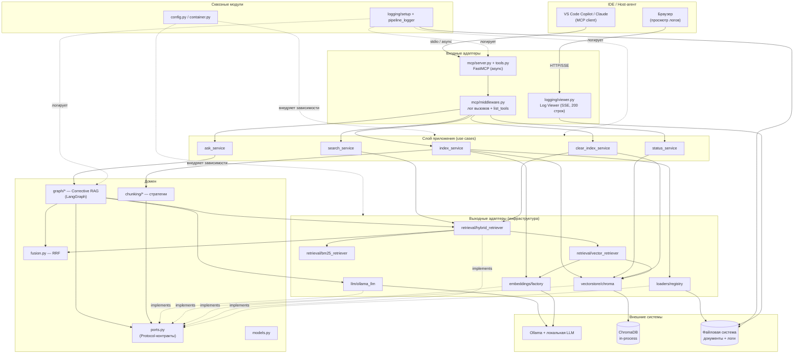
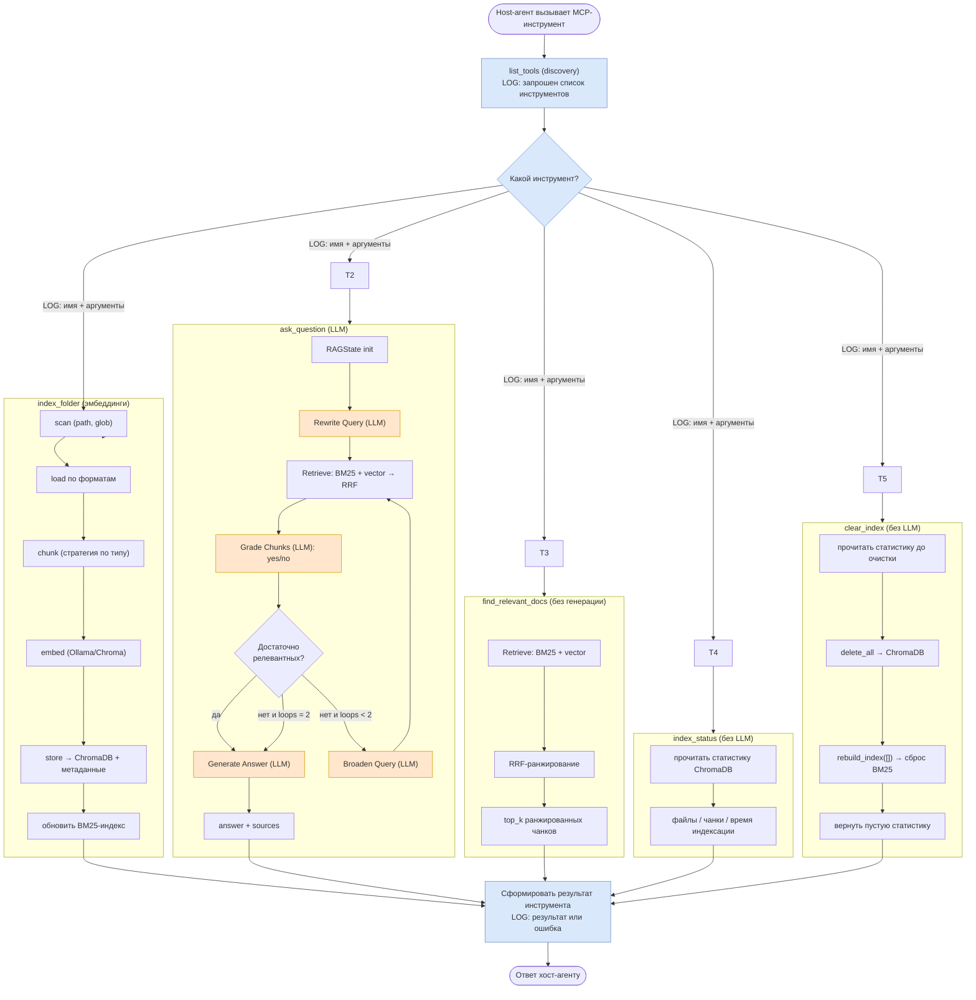
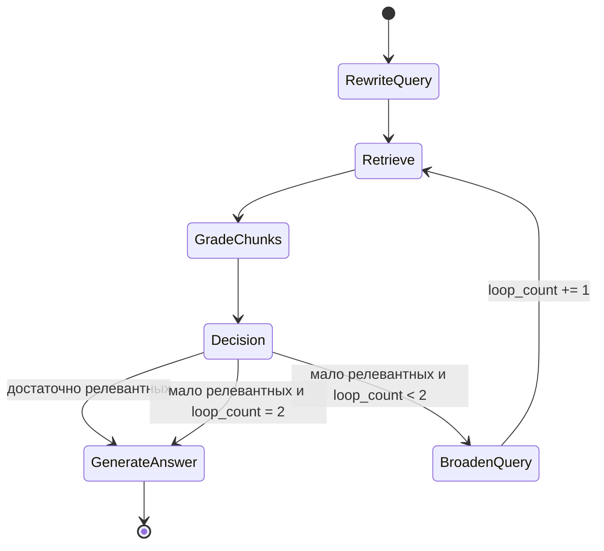
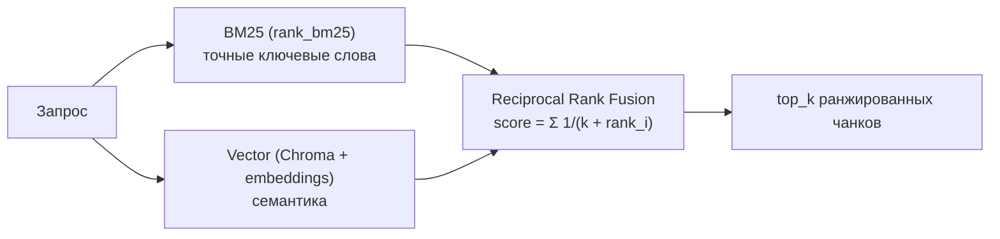
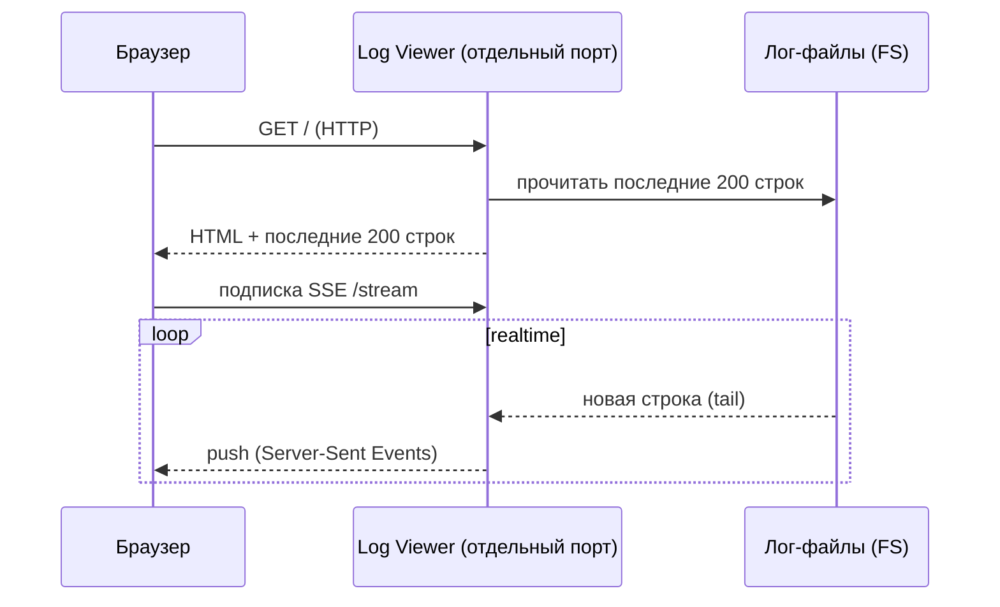
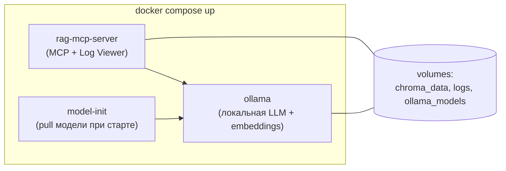

# Архитектура: RAG Knowledge Base MCP-сервер

Документ описывает архитектуру системы к реализации. Источники требований:
[source_task.md](source_task.md) (исходное задание) и
[self_requirements.md](self_requirements.md) (дополнительные требования).

---

## 1. Обзор системы

MCP-сервер превращает локальную папку с документами в поисковую базу знаний.
Разработчик подключает сервер к IDE (VS Code Copilot, Claude и др.), индексирует
документы и задаёт вопросы. Внутри — **Corrective RAG**-пайплайн на LangGraph с
локальной LLM через Ollama и гибридным поиском (BM25 + векторный, объединение
через RRF).

### 1.1. Ключевые архитектурные драйверы

| Драйвер | Источник | Влияние на архитектуру |
| --- | --- | --- |
| 5 MCP-инструментов с богатым `description` и описаниями параметров (`Annotated`) | задание + расширение | Тонкий MCP-слой над сервисами приложения |
| Corrective RAG (rewrite → retrieve → grade → generate, retry ≤ 2) | задание | LangGraph как отдельный модуль-оркестратор |
| Гибридный поиск BM25 + vector → RRF | задание | Абстракция `Retriever` + `EnsembleRetriever`/RRF |
| Локальная LLM/эмбеддинги (Ollama, без платных API) | задание | Провайдеры LLM/Embeddings за интерфейсами |
| Асинхронный протокол MCP | self-req 2.1 | async/await сквозь все слои, неблокирующий event loop |
| Логирование каждого вызова и каждого шага пайплайна | self-req 1.1–1.2 | Сквозной модуль логирования + декораторы/хуки |
| Ротация логов по 1 МБ | self-req 1.3 | `RotatingFileHandler(maxBytes=1MB)` |
| Live-просмотр логов на отдельном порту (200 строк, realtime) | self-req 1.4 | Отдельный HTTP-сервис + SSE/WebSocket |
| SOLID + высокое покрытие тестами | self-req 3.1–3.2 | Гексагональная компоновка, инъекция зависимостей |
| Переключаемые эмбеддинги (доп. задание) | задание | Фабрика провайдеров из конфига |

### 1.2. Архитектурный стиль

Гексагональная архитектура (Ports & Adapters) с инверсией зависимостей:

- **Адаптеры на входе** — MCP-сервер (FastMCP), Log Viewer (HTTP).
- **Слой приложения** — сервисы-сценарии (use cases) для 5 инструментов.
- **Домен** — Corrective RAG-граф, чанкинг, RRF, контракты (ports).
- **Адаптеры на выходе (инфраструктура)** — Ollama (LLM/embeddings), ChromaDB,
  BM25, файловые загрузчики, логирование.

Все зависимости направлены внутрь, к доменным абстракциям; конкретные реализации
внедряются через фабрику/конфиг (DIP, OCP, LSP).

---

## 2. Структура проекта

```text
final_project/
├─ src/rag_mcp/
│  ├─ __main__.py                # точка входа: запуск MCP + Log Viewer
│  ├─ config.py                  # Settings (pydantic-settings), загрузка из env/.env
│  ├─ container.py               # композиция зависимостей (фабрики, DI)
│  │
│  ├─ mcp/                       # ВХОДНОЙ адаптер: MCP (FastMCP, async)
│  │  ├─ server.py               # создание FastMCP, регистрация инструментов
│  │  ├─ tools.py                # 5 инструментов: description + Annotated-параметры
│  │  ├─ progress.py             # MCP notifications/progress для index_folder
│  │  └─ middleware.py           # логирование вызовов и list_tools
│  │
│  ├─ application/               # СЛОЙ ПРИЛОЖЕНИЯ: use cases
│  │  ├─ index_service.py        # index_folder: scan→load→chunk→embed→store
│  │  ├─ index_progress.py       # IndexProgressTracker: 0–100% по этапам индексации
│  │  ├─ ask_progress.py        # AskProgressTracker: шаги Corrective RAG
│  │  ├─ search_progress.py      # SearchProgressTracker: BM25 → vector → RRF
│  │  ├─ progress_tracker.py     # общий ProgressTracker + OnProgress
│  │  ├─ ask_service.py          # ask_question: запуск Corrective RAG-графа
│  │  ├─ search_service.py       # find_relevant_docs: гибридный поиск без LLM
│  │  ├─ status_service.py       # index_status: статистика индекса
│  │  └─ clear_index_service.py  # clear_index: удаление всех чанков из ChromaDB + сброс BM25
│  │
│  ├─ domain/                    # ДОМЕН: контракты и бизнес-логика
│  │  ├─ ports.py                # Protocol-интерфейсы (LLM, Embeddings, VectorStore,
│  │  │                          #   Retriever, DocumentLoader, Chunker, Logger)
│  │  ├─ models.py               # dataclasses: Chunk, Document, GradedChunk, Answer...
│  │  ├─ graph/                  # Corrective RAG (LangGraph)
│  │  │  ├─ state.py             # RAGState (TypedDict)
│  │  │  ├─ nodes.py             # rewrite, retrieve, grade, generate, broaden
│  │  │  ├─ edges.py             # условные переходы (enough? / loops<2)
│  │  │  └─ builder.py           # сборка StateGraph → CompiledGraph
│  │  ├─ chunking/               # стратегии чанкинга (текст/код/структуры)
│  │  │  ├─ base.py              # интерфейс Chunker
│  │  │  └─ factory.py           # выбор стратегии по типу файла
│  │  └─ fusion.py               # Reciprocal Rank Fusion (RRF)
│  │
│  ├─ infrastructure/            # ВЫХОДНЫЕ адаптеры
│  │  ├─ llm/ollama_llm.py       # LLM через Ollama (async)
│  │  ├─ embeddings/             # провайдеры эмбеддингов (chroma default / ollama)
│  │  │  └─ factory.py           # переключение через конфиг (доп. задание)
│  │  ├─ vectorstore/chroma.py   # ChromaDB (in-process)
│  │  ├─ retrieval/
│  │  │  ├─ vector_retriever.py  # плотный поиск
│  │  │  ├─ bm25_retriever.py    # rank_bm25 (sparse)
│  │  │  └─ hybrid_retriever.py  # BM25 + vector → RRF
│  │  └─ loaders/                # document loaders по форматам
│  │     └─ registry.py          # реестр загрузчиков (.md/.txt/.py/.js/.ts/.json/.yaml)
│  │
│  └─ logging/                   # СКВОЗНОЙ модуль логирования
│     ├─ setup.py                # конфигурация, RotatingFileHandler (1 МБ)
│     ├─ pipeline_logger.py      # пошаговое логирование пайплайнов
│     └─ viewer.py               # HTTP-сервис live-просмотра (SSE, 200 строк)
│
├─ tests/                        # unit / integration / e2e
├─ sample_docs/                  # демо-документы (≥ 500 КБ)
├─ docs/                         # ARCHITECTURE.md, source_task.md, ...
├─ docker-compose.yml            # server + ollama + модель
├─ Dockerfile
├─ pyproject.toml
├─ mcp.config.example.json       # пример подключения MCP к VS Code Copilot
├─ README.md
└─ REPORT.md
```

---

## 3. Диаграмма связи модулей (обязательная)

Показывает зависимости между модулями по слоям. Стрелки направлены к зависимостям;
все конкретные реализации зависят от доменных контрактов (`domain/ports.py`).



---

## 4. Диаграмма пайплайна работы MCP-инструментов (обязательная)

Показывает сквозной поток для каждого из 5 инструментов: от вызова хост-агентом до
ответа, с пометками где требуется LLM и где пишутся логи.



> На диаграмме: оранжевым выделены шаги, требующие **локальной LLM**; синим — точки
> **логирования** (discovery, вход с параметрами, результат/ошибка). Каждый
> промежуточный шаг `ask_question` и `index_folder` логируется отдельно (см. §8).

---

## 5. LangGraph: Corrective RAG

### 5.1. Состояние графа (`RAGState`)

| Поле | Тип | Назначение |
| --- | --- | --- |
| `question` | str | Исходный вопрос пользователя |
| `query` | str | Текущий (пере)сформулированный запрос |
| `chunks` | list[Chunk] | Найденные чанки текущей итерации |
| `graded` | list[GradedChunk] | Чанки с оценкой relevant yes/no |
| `relevant` | list[Chunk] | Отфильтрованные релевантные чанки |
| `loop_count` | int | Счётчик циклов расширения (≤ 2) |
| `answer` | str | Итоговый ответ |
| `sources` | list[Source] | Источники (файл + позиция) |

### 5.2. Узлы и переходы



- **RewriteQuery** — нормализует/уточняет запрос (LLM).
- **Retrieve** — гибридный поиск BM25 + vector, объединение через RRF.
- **GradeChunks** — корректирующий шаг: LLM оценивает релевантность каждого чанка
  (yes/no). Даёт имя паттерну Corrective RAG.
- **Decision** — условное ребро: если релевантных достаточно (порог из конфига) →
  генерация; иначе при `loop_count < 2` → расширение запроса и повтор; на 2-й
  итерации форсируем генерацию с тем, что есть.
- **BroadenQuery** — расширяет/переформулирует запрос (LLM), `loop_count += 1`.
- **GenerateAnswer** — генерирует ответ с цитированием источников (LLM).

### 5.3. Тестируемость

Граф зависит от портов `LLMPort` и `RetrieverPort`, поэтому в unit-тестах LLM и
retriever заменяются mock-ами; проверяются ветвления (достаточно/мало релевантных),
ограничение циклов (≤ 2) и формирование источников.

---

## 6. Индексация документов

### 6.1. Поддерживаемые форматы и загрузчики

| Категория | Расширения | Загрузчик | Стратегия чанкинга |
| --- | --- | --- | --- |
| Текст | `.md`, `.txt` | text loader | по заголовкам/абзацам, recursive split |
| Код | `.py`, `.js`, `.ts` | code loader | language-aware splitter (по функциям/классам) |
| Структуры | `.json`, `.yaml` | structured loader | по ключам/верхнеуровневым узлам |

Реестр загрузчиков (`loaders/registry.py`) сопоставляет расширение → загрузчик +
чанкер (OCP: новый формат добавляется без правки ядра).

### 6.2. Метаданные чанка

Сохраняются обязательно: `source` (путь к файлу), `position` (индекс/смещение
чанка), `file_type`, `chunk_id`. В metadata коллекции ChromaDB хранится
`last_indexed_at` (ISO-8601). Используются для цитирования источников в ответе
и для `index_status` (`file_count` — distinct `source` по всем чанкам в коллекции).

### 6.3. Поток `index_folder`

`scan(glob)` → `load` → `chunk` → `embed` → `store(ChromaDB)` → полная
пересборка BM25-индекса из **всех** чанков в ChromaDB (не только текущей папки).
При старте процесса `Container` гидратирует BM25 из ChromaDB, если коллекция
непуста. Каждый подшаг логируется с промежуточным результатом (кол-во файлов,
чанков, ошибки отдельных файлов не прерывают весь процесс).

**Прогресс 0–100% (MCP `notifications/progress`):** для `index_folder`, `ask_question`
и `find_relevant_docs` при `progressToken` от клиента. Сообщение включает имя шага
пайплайна. `index_folder`: scan → файлы → embed → store. `ask_question`: Rewrite →
Retrieve → Grade (по чанкам) → Broaden (при цикле) → Generate. `find_relevant_docs`:
BM25 → Vector → RRF. Общий `ProgressTracker`: MCP-callback на каждый шаг, в лог
`pipeline_progress` — только при смене процента.

### 6.4. Поток `clear_index`

`get_stats` (до очистки) → `delete_all(ChromaDB)` → `rebuild_index([])` (сброс
BM25 в памяти) → `get_stats` (пустой индекс). Исходные файлы на диске не
затрагиваются. После очистки `ask_question` и `find_relevant_docs` возвращают
пустой результат до повторной индексации.

---

## 7. Гибридный поиск и RRF



RRF объединяет два ранжированных списка без зависимости от абсолютных скоров:
итоговый ранг определяется позициями документа в обоих списках. Это покрывает и
семантические вопросы, и точечные (например, поиск конкретной константы).
`HybridRetriever` реализует `RetrieverPort` и используется и в графе
(`ask_question`), и напрямую в `find_relevant_docs`.

---

## 8. Логирование (self-requirements §1)

### 8.1. Что логируется

| Событие | Источник требования | Где |
| --- | --- | --- |
| Параметры запуска сервера (конфиг, порт, пути, env без секретов, режим) | 1.1 | `__main__` / `setup.py` |
| `list_tools` / discovery | 1.1 | `mcp/middleware.py` |
| Каждый вызов инструмента: имя, аргументы, результат/ошибка | 1.1 | `mcp/middleware.py` |
| Каждый шаг многошаговых пайплайнов с промежуточным результатом | 1.2 | `logging/pipeline_logger.py` |

Для `ask_question` логируются: исходный вопрос, переписанный запрос, retrieve
(запрос, top-k, список чанков id/источник/скор, сводка BM25 и vector до RRF), grade
(оценка каждого чанка + число релевантных), broaden (расширенный запрос + номер
итерации), generate (ответ/сокращённо + источники). Аналогично для `index_folder`
(включая `pipeline_progress`: percent + message шага) и `clear_index` (статистика до очистки).

### 8.2. Ротация (1.3)

`RotatingFileHandler(maxBytes=1_000_000, backupCount=N)` — новый файл при 1 МБ,
старые сохраняются для анализа. Формат — человекочитаемые строки (не JSON):
`YYYY.MM.DD HH:MM:SS.cc: event; key=value, ...`. `HumanReadableFormatter` применяется
ко всем записям `rag_mcp`, включая legacy JSON (парсинг fallback). Log viewer
также форматирует JSON-строки при отображении. Между вызовами `ask_question`
в лог добавляется пустая строка-разделитель.

### 8.3. Log Viewer (1.4)



Отдельный async HTTP-сервис (порт из конфига) отдаёт страницу с последними 200
строками и обновляет их в реальном времени через SSE (tail лог-файла). Не блокирует
event loop MCP-сервера.

---

## 9. Асинхронность MCP (self-requirements §2)

- FastMCP работает в async-режиме; все инструменты — `async def`.
- LLM/эмбеддинги/ChromaDB вызовы — через async-обёртки; блокирующие операции
  (BM25-индексация, чтение файлов) выносятся в thread pool (`asyncio.to_thread`),
  чтобы не блокировать event loop при ожидании LLM/индексации/хранилища.
- MCP-сервер и Log Viewer работают в одном event loop как отдельные задачи.

---

## 10. Конфигурация (нет хардкода)

`config.py` на `pydantic-settings`, значения из env/`.env`. Ключевые параметры:

| Параметр | Назначение | Пример |
| --- | --- | --- |
| `OLLAMA_BASE_URL` | адрес Ollama | `http://ollama:11434` |
| `LLM_MODEL` | модель генерации | `phi3:mini` / `qwen2.5:3b` |
| `EMBEDDING_PROVIDER` | `chroma` или `ollama` (доп. задание) | `ollama` |
| `EMBEDDING_MODEL` | модель эмбеддингов | `nomic-embed-text` |
| `CHROMA_PATH` | путь хранилища | `/data/chroma` |
| `CHUNK_SIZE` / `CHUNK_OVERLAP` | параметры чанкинга | `800 / 100` |
| `TOP_K` | размер выдачи retrieve | `5` |
| `RRF_K` | константа RRF | `60` |
| `GRADE_RELEVANCE_THRESHOLD` | порог «достаточно релевантных» | `3` |
| `MAX_BROADEN_LOOPS` | лимит циклов расширения | `2` |
| `LOG_DIR` / `LOG_MAX_BYTES` | логи и ротация | `/data/logs` / `1000000` |
| `LOG_VIEWER_PORT` | порт live-просмотра | `8765` |

Переключение провайдера эмбеддингов — только через `EMBEDDING_PROVIDER`, без правки
остального кода (фабрика в `embeddings/factory.py`).

---

## 11. Инфраструктура (Docker Compose)



- Сервисы: `rag-mcp-server`, `ollama`, инициализация модели (pull при старте).
- Запуск одной командой: `docker compose up`.
- Тома для персистентности ChromaDB, логов и моделей Ollama.

---

## 12. Тестирование (self-requirements §3.2, задание)

| Тип | Объект | Подход |
| --- | --- | --- |
| unit | узлы и рёбра LangGraph | mock LLM/retriever, проверка ветвлений и лимита циклов |
| unit | RRF (`fusion.py`) | детерминированные списки → ожидаемый порядок |
| unit | чанкеры | корректность разбивки по типам файлов + метаданные |
| unit | конфиг/фабрики | переключение провайдеров, дефолты |
| unit | логирование | формат записей, шаги пайплайна |
| unit | ротация логов | превышение 1 МБ → новый файл |
| integration | индексер | реальный ChromaDB (in-process) на временной папке |
| integration | гибридный retriever | BM25 + vector на тестовом корпусе |
| e2e | 5 MCP-инструментов | вызовы через MCP, проверка входов/выходов/ошибок |
| e2e | проверочные факты | ответ содержит специфические факты из базы |

Минимум ≥ 10 тестов; цель — покрыть всё тестируемое (юнит/интеграция).

---

## 13. Соответствие SOLID

| Принцип | Реализация |
| --- | --- |
| **S** | Отдельные модули: индексация, retrieval, граф, MCP-обёртка, логирование |
| **O** | Новые форматы/ретриверы/провайдеры через реестры и фабрики без правки ядра |
| **L** | LLM/VectorStore/Logger/Retriever за `Protocol`-контрактами, заменяемы в тестах |
| **I** | Узкие порты (`LLMPort`, `EmbeddingsPort`, `RetrieverPort`, ...) вместо «бога» |
| **D** | Зависимость от абстракций; реализации внедряются через `container.py`/конфиг |

---

## 14. Обработка ошибок

- Ошибки отдельных файлов при индексации не прерывают весь процесс; фиксируются в
  логе и в итоговой статистике.
- MCP-инструменты возвращают структурированные ошибки (а не падают), логируя
  причину.
- Недоступность Ollama/ChromaDB → понятное сообщение об ошибке инструмента.

---

## 15. Риски и решения

| Риск | Решение |
| --- | --- |
| Блокировка event loop при LLM/индексации | async + `asyncio.to_thread` для блокирующих операций |
| BM25-индекс в памяти при большом корпусе | при старте — гидратация из ChromaDB; после `index_folder` — полная пересборка BM25 из всех чанков в store; `index_status` читает `file_count` и `last_indexed_at` из Chroma metadata |
| Зацикливание Corrective RAG | жёсткий лимит `MAX_BROADEN_LOOPS = 2`, форс-генерация |
| Хардкод параметров | вся конфигурация в `config.py` из env |
| Расхождение описаний инструментов с поведением | содержательные `description` и `Annotated`-описания параметров, проверяемые e2e и шагом сдачи 5 |

---

## 16. Порядок реализации (рекомендуемый)

1. Каркас проекта, `config.py`, `container.py`, логирование с ротацией.
2. Загрузчики + чанкеры + `index_service` + ChromaDB.
3. Retrieval: vector, BM25, hybrid + RRF; `search_service` + `status_service`.
4. LangGraph Corrective RAG + `ask_service`.
5. MCP-слой (FastMCP, async) с богатыми `description` + middleware-логирование.
6. Log Viewer (SSE).
7. Docker Compose + `mcp.config.example.json`.
8. Тесты (unit → integration → e2e), CI (lint + тесты).
9. Демо-документы (≥ 500 КБ) с проверочными фактами, README/REPORT.

---

## 17. CI/CD

GitHub Actions workflow [`.github/workflows/ci.yml`](../.github/workflows/ci.yml):

| Job | Шаги |
| --- | --- |
| `lint-and-test` | Python 3.12 → `pip install -e ".[dev]"` → `ruff check src tests` → `pytest tests/` |
| `docker-build` | `docker build -t rag-mcp-server:ci .` |

Триггеры: `push` и `pull_request` на ветки `main` / `master`. Тесты не требуют запущенного Ollama (mock LLM в unit/e2e).

---

## 18. Статус реализации

| Фаза | Статус |
| --- | --- |
| 0–13 | Реализовано: каркас, домен, логи, загрузчики, ChromaDB, retrieval, сервисы, LangGraph, MCP, Log Viewer, Docker, sample_docs (~1.9 МБ), 61+ тест |
| 14 | CI pipeline — GitHub Actions (ruff + pytest + docker build) |
| 15 | README (сценарий сдачи), REPORT, ARCHITECTURE актуализированы |
| 16 | MCP-инструмент `clear_index` — полная очистка ChromaDB и BM25-индекса |

Ключевые файлы соответствуют структуре из §2. `Settings` использует `populate_by_name=True` для корректной инициализации путей в тестах и DI.
