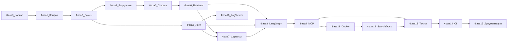

# План реализации RAG Knowledge Base MCP-сервер

План основан на [source_task.md](source_task.md), [ARCHITECTURE.md](ARCHITECTURE.md) и [self_requirements.md](self_requirements.md). Текущее состояние репозитория: **фазы 0–13 реализованы** (54 теста green).

Отмечайте выполненные шаги, заменяя `[ ]` на `[x]`.

---

## Фаза 0. Инициализация репозитория

- [x] **0.1. Каркас Python-проекта**
  - Создать `pyproject.toml` (зависимости: FastMCP, LangGraph, LangChain, ChromaDB, rank_bm25, pydantic-settings, httpx/aiohttp, pytest, ruff).
  - Создать структуру каталогов по [ARCHITECTURE.md §2](ARCHITECTURE.md): `src/rag_mcp/`, `tests/`, `sample_docs/`.
  - **Проверка:** `pip install -e ".[dev]"` завершается без ошибок; `python -c "import rag_mcp"` работает.

- [x] **0.2. Точка входа и пакет**
  - Добавить `src/rag_mcp/__init__.py`, заглушку `__main__.py`.
  - **Проверка:** `python -m rag_mcp --help` (или graceful exit) не падает с ImportError.

---

## Фаза 1. Конфигурация и DI

- [x] **1.1. Settings (`config.py`)**
  - Реализовать `pydantic-settings`: OLLAMA_BASE_URL, LLM_MODEL, EMBEDDING_PROVIDER, EMBEDDING_MODEL, CHROMA_PATH, CHUNK_SIZE/OVERLAP, TOP_K, RRF_K, GRADE_RELEVANCE_THRESHOLD, MAX_BROADEN_LOOPS, LOG_DIR, LOG_MAX_BYTES, LOG_VIEWER_PORT.
  - Поддержка `.env` и переменных окружения.
  - **Проверка:** unit-тест: дефолты загружаются; переопределение через env работает.

- [x] **1.2. Контейнер зависимостей (`container.py`)**
  - Фабрика сборки сервисов из Settings (заглушки портов на этом этапе).
  - **Проверка:** `Container(settings).build()` возвращает объект без исключений.

---

## Фаза 2. Доменный слой

- [x] **2.1. Модели (`domain/models.py`)**
  - Dataclasses: `Chunk`, `Document`, `GradedChunk`, `Source`, `IndexStats`, `Answer`.
  - **Проверка:** unit-тест сериализации/полей моделей.

- [x] **2.2. Порты (`domain/ports.py`)**
  - Protocol-интерфейсы: `LLMPort`, `EmbeddingsPort`, `VectorStorePort`, `RetrieverPort`, `DocumentLoaderPort`, `ChunkerPort`, `LoggerPort`.
  - **Проверка:** mock-реализации удовлетворяют Protocol (mypy/pyright или runtime `isinstance` через `@runtime_checkable`).

- [x] **2.3. RRF (`domain/fusion.py`)**
  - Reciprocal Rank Fusion: `score = Σ 1/(k + rank_i)`.
  - **Проверка:** unit-тест на детерминированных списках — ожидаемый порядок top-k.

---

## Фаза 3. Логирование

- [x] **3.1. Настройка логов (`logging/setup.py`)**
  - `RotatingFileHandler(maxBytes=1_000_000)`; JSON-формат строк.
  - Лог параметров запуска сервера (без секретов).
  - **Проверка:** запись >1 МБ создаёт `.log.1`; тест ротации проходит.

- [x] **3.2. Pipeline logger (`logging/pipeline_logger.py`)**
  - Методы для шагов: rewrite, retrieve, grade, broaden, generate, index_folder (scan/load/chunk/embed/store).
  - **Проверка:** unit-тест: вызов каждого метода пишет JSON-строку с ожидаемыми полями.

---

## Фаза 4. Загрузка и чанкинг документов

- [x] **4.1. Реестр загрузчиков (`infrastructure/loaders/registry.py`)**
  - Поддержка: `.md`, `.txt`, `.py`, `.js`, `.ts`, `.json`, `.yaml`.
  - **Проверка:** integration-тест: каждый формат загружается в `Document` без ошибок.

- [x] **4.2. Стратегии чанкинга (`domain/chunking/`)**
  - Текст — recursive/по абзацам; код — language-aware; JSON/YAML — по ключам.
  - Метаданные: `source`, `position`, `file_type`, `chunk_id`.
  - **Проверка:** unit-тесты на образцах каждого типа; метаданные присутствуют.

- [x] **4.3. Фабрика чанкеров (`domain/chunking/factory.py`)**
  - Выбор стратегии по расширению файла.
  - **Проверка:** `.py` → code chunker, `.md` → text chunker (unit-тест).

---

## Фаза 5. Хранилище и эмбеддинги

- [x] **5.1. ChromaDB адаптер (`infrastructure/vectorstore/chroma.py`)**
  - In-process ChromaDB; add/search/delete; статистика (файлы, чанки, время индексации).
  - **Проверка:** integration-тест: add 3 чанка → search возвращает top-1 с правильным source.

- [x] **5.2. Фабрика эмбеддингов (`infrastructure/embeddings/factory.py`)**
  - Переключение `EMBEDDING_PROVIDER`: `chroma` (default) / `ollama` (`nomic-embed-text`).
  - **Проверка:** unit-тест: смена env → другой класс провайдера; остальной код не меняется.

- [x] **5.3. Ollama LLM (`infrastructure/llm/ollama_llm.py`)**
  - Async-обёртка над Ollama API.
  - **Проверка:** при запущенном Ollama — smoke-тест `generate("ping")` возвращает непустой ответ; без Ollama — понятная ошибка.

---

## Фаза 6. Retrieval (гибридный поиск)

- [x] **6.1. Vector retriever (`infrastructure/retrieval/vector_retriever.py`)**
  - Плотный поиск через ChromaDB + embeddings.
  - **Проверка:** integration-тест на индексированном корпусе.

- [x] **6.2. BM25 retriever (`infrastructure/retrieval/bm25_retriever.py`)**
  - `rank_bm25`; пересборка индекса при `index_folder`; `asyncio.to_thread` для блокирующих операций.
  - **Проверка:** unit/integration: точечный запрос по ключевому слову находит нужный чанк.

- [x] **6.3. Hybrid retriever (`infrastructure/retrieval/hybrid_retriever.py`)**
  - BM25 + vector → RRF; реализует `RetrieverPort`.
  - **Проверка:** integration-тест: семантический и keyword-запросы дают ожидаемые top-k.

---

## Фаза 7. Сервисы приложения (индексация и поиск)

- [x] **7.1. Index service (`application/index_service.py`)**
  - Поток: scan(glob) → load → chunk → embed → store → обновить BM25.
  - Ошибки отдельных файлов не прерывают процесс; логирование каждого шага.
  - **Проверка:** индексация тестовой папки (7 форматов) → ChromaDB содержит чанки с метаданными; в логе — все шаги.

- [x] **7.2. Status service (`application/status_service.py`)**
  - Статистика: кол-во файлов, чанков, время последней индексации.
  - **Проверка:** до индексации — нули/пусто; после `index_folder` — корректные числа.

- [x] **7.3. Search service (`application/search_service.py`)**
  - `find_relevant_docs(query, top_k)` — гибридный поиск без LLM.
  - **Проверка:** возвращает ранжированный список с source/position/score.

---

## Фаза 8. LangGraph — Corrective RAG

- [x] **8.1. Состояние графа (`domain/graph/state.py`)**
  - `RAGState` TypedDict: question, query, chunks, graded, relevant, loop_count, answer, sources.
  - **Проверка:** типы соответствуют ARCHITECTURE §5.1.

- [x] **8.2. Узлы графа (`domain/graph/nodes.py`)**
  - RewriteQuery, Retrieve, GradeChunks, BroadenQuery, GenerateAnswer — через порты LLM/Retriever.
  - **Проверка:** unit-тесты каждого узла с mock LLM/retriever.

- [x] **8.3. Условные рёбра (`domain/graph/edges.py`)**
  - Decision: достаточно релевантных → generate; иначе broaden (если loop_count < 2); на 2-й итерации — force generate.
  - **Проверка:** unit-тесты ветвлений: «достаточно», «мало + loop 0», «мало + loop 2».

- [x] **8.4. Сборка графа (`domain/graph/builder.py`)**
  - `StateGraph` → `CompiledGraph`.
  - **Проверка:** e2e графа с mock: полный путь rewrite→retrieve→grade→generate; путь с broaden (1 retry).

- [x] **8.5. Ask service (`application/ask_service.py`)**
  - Запуск графа; логирование всех шагов через pipeline_logger.
  - **Проверка:** `ask_question("...")` возвращает `{answer, sources}`; в логе — все шаги пайплайна.

---

## Фаза 9. MCP-слой (FastMCP, async)

- [x] **9.1. MCP server (`mcp/server.py`)**
  - Создание FastMCP; async-режим; запуск в `__main__.py` параллельно с Log Viewer.
  - **Проверка:** сервер стартует на stdio без блокировки event loop.

- [x] **9.2. Четыре инструмента (`mcp/tools.py`)**
  - `index_folder(path, glob)`, `ask_question(question)`, `find_relevant_docs(query, top_k)`, `index_status()`.
  - Содержательные `description` для автовыбора хост-агентом.
  - **Проверка:** MCP Inspector / `list_tools` — 4 инструмента с description; сценарий сдачи (шаг 6 source_task) проходит.

- [x] **9.3. Middleware (`mcp/middleware.py`)**
  - Лог: list_tools, имя инструмента + аргументы + результат/ошибка.
  - **Проверка:** после вызова инструмента в лог-файле есть запись с параметрами.

- [x] **9.4. Обработка ошибок MCP**
  - Структурированные ошибки (недоступный Ollama, несуществующий путь, пустой индекс).
  - **Проверка:** вызов `ask_question` без индекса/Ollama → понятное сообщение, сервер не падает.

---

## Фаза 10. Log Viewer (SSE)

- [x] **10.1. HTTP-сервис (`logging/viewer.py`)**
  - `GET /` — HTML с последними 200 строками; `GET /stream` — SSE realtime tail.
  - Отдельный порт (`LOG_VIEWER_PORT`); не блокирует MCP.
  - **Проверка:** открыть `http://localhost:8765` в браузере — 200 строк; новая запись в логе появляется без перезагрузки.

---

## Фаза 11. Docker Compose

- [x] **11.1. Dockerfile**
  - Multi-stage или slim; установка зависимостей; `CMD` для MCP-сервера.
  - **Проверка:** `docker build .` успешен.

- [x] **11.2. docker-compose.yml**
  - Сервисы: `rag-mcp-server`, `ollama`, `model-init` (pull LLM + embedding model).
  - Volumes: chroma_data, logs, ollama_models.
  - **Проверка:** `docker compose up` — все сервисы healthy; Ollama отвечает; модели загружены.

- [x] **11.3. Пример MCP-конфига**
  - `mcp.config.example.json` для VS Code Copilot.
  - **Проверка:** по инструкции из README агент подключается и видит 4 инструмента.

---

## Фаза 12. Демо-документы и проверочные факты

- [x] **12.1. Каталог `sample_docs/` (≥ 500 КБ)**
  - Документы всех обязательных форматов; необычные проверочные факты (числа, имена, даты).
  - **Проверка:** `du -sh sample_docs/` ≥ 500K; файлы всех 7 расширений присутствуют.

- [x] **12.2. Проверочные факты в README**
  - Список фактов для проверки RAG (шаг 5 сдачи).
  - **Проверка:** `ask_question` по каждому факту возвращает правильное значение + source из sample_docs.

---

## Фаза 13. Тесты (≥ 10)

- [x] **13.1. Unit-тесты**
  - RRF, чанкеры, узлы/рёбра графа (mock LLM), конфиг, ротация логов, pipeline logger.
  - **Проверка:** `pytest tests/unit/` — все green.

- [x] **13.2. Integration-тесты**
  - Индексер + ChromaDB; hybrid retriever на тестовом корпусе.
  - **Проверка:** `pytest tests/integration/` — все green.

- [x] **13.3. E2E тесты MCP**
  - 4 инструмента: пустой index_status → index_folder → index_status → ask_question → find_relevant_docs.
  - **Проверка:** `pytest tests/e2e/` — все green; общее число тестов ≥ 10.

---

## Фаза 14. CI pipeline

- [ ] **14.1. GitHub Actions (или аналог)**
  - Jobs: lint (ruff) + pytest.
  - Опционально: сборка Docker-образа.
  - **Проверка:** push в репозиторий → CI green.

---

## Фаза 15. Документация для сдачи

- [ ] **15.1. README.md**
  - Запуск (`docker compose up`), подключение MCP, примеры вызовов, проверочные факты.
  - **Проверка:** преподаватель по README воспроизводит шаги 2–6 процесса сдачи.

- [ ] **15.2. REPORT.md**
  - История разработки, AI-инструменты, показательный промпт с разбором.
  - **Проверка:** документ непустой, содержит минимум один пример промпта.

- [ ] **15.3. ARCHITECTURE.md**
  - Актуализировать при расхождении с реализацией (после каждой фазы с кодом).
  - **Проверка:** структура проекта в документе совпадает с фактической.

---

## Диаграмма зависимостей фаз

---

## Итоговая проверка (процесс сдачи)

После выполнения всех фаз — сквозной чеклист по [source_task.md §Процесс сдачи](source_task.md):

- [ ] `docker compose up` поднимает сервер + Ollama + модели
- [ ] Агент в IDE сам выбирает MCP-инструменты по description
- [ ] `index_status()` → пустой → `index_folder("./sample_docs")` → статистика
- [ ] `ask_question(...)` → ответ с источниками и проверочными фактами
- [ ] `find_relevant_docs(...)` → ранжированные чанки
- [ ] CI: lint + тесты green
- [ ] Code review: граф LangGraph, тесты, SOLID-структура
